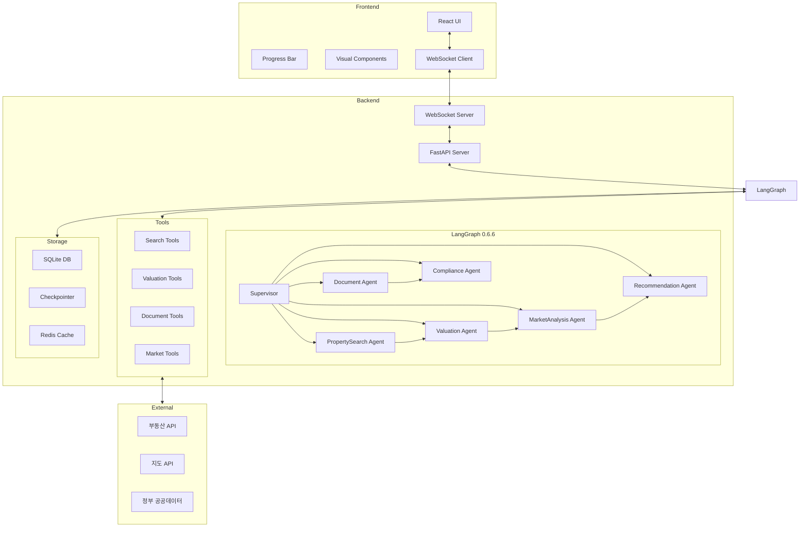

# 🏢 Real Estate AI Agent System - Implementation Plan
**LangGraph 0.6.6 기반 부동산 AI 플랫폼 구축 계획**

## 📌 Executive Summary

### 프로젝트 개요
- **목표**: LangGraph 0.6.6을 활용한 지능형 부동산 서비스 플랫폼
- **핵심 기능**: 매물 검색, 시세 분석, 문서 생성, 법규 검토, 시장 분석
- **기술 스택**: LangGraph 0.6.6, FastAPI, React, WebSocket, SQLite
- **개발 기간**: 4주 (Phase별 순차 개발)

### 주요 특징
1. **Supervisor Pattern**: 중앙 통제 및 효율적 라우팅
2. **실시간 Progress Bar**: 처리 상태 시각화
3. **부동산 특화 도구**: 시세 조회, 대출 계산, 투자 분석
4. **자동 워크플로우**: 검색→평가→분석→추천 자동화

---

## 🏗️ System Architecture



---

## 📁 Project Structure

```
real-estate-ai/
├── backend/
│   ├── src/
│   │   ├── agents/                 # 에이전트 구현
│   │   │   ├── __init__.py
│   │   │   ├── supervisor.py       # 감독 에이전트
│   │   │   ├── property_search.py  # 매물 검색
│   │   │   ├── valuation.py        # 시세 분석
│   │   │   ├── document.py         # 문서 생성
│   │   │   ├── compliance.py       # 법규 검토
│   │   │   ├── market_analysis.py  # 시장 분석
│   │   │   └── recommendation.py   # 추천 시스템
│   │   │
│   │   ├── core/                   # 핵심 시스템
│   │   │   ├── __init__.py
│   │   │   ├── graph.py           # StateGraph 구성
│   │   │   ├── state.py           # RealEstateState
│   │   │   └── checkpointer.py    # 상태 저장
│   │   │
│   │   ├── tools/                  # 도구 함수
│   │   │   ├── __init__.py
│   │   │   ├── search_tools.py    # 검색 도구
│   │   │   ├── valuation_tools.py # 평가 도구
│   │   │   ├── document_tools.py  # 문서 도구
│   │   │   └── market_tools.py    # 시장 도구
│   │   │
│   │   ├── api/                    # API 엔드포인트
│   │   │   ├── __init__.py
│   │   │   ├── routes.py          # REST API
│   │   │   ├── websocket.py      # WebSocket
│   │   │   └── models.py         # Pydantic 모델
│   │   │
│   │   ├── database/              # 데이터베이스
│   │   │   ├── __init__.py
│   │   │   ├── models.py         # SQLAlchemy 모델
│   │   │   ├── crud.py           # CRUD 작업
│   │   │   └── connection.py     # DB 연결
│   │   │
│   │   └── utils/                 # 유틸리티
│   │       ├── __init__.py
│   │       ├── logger.py         # 로깅
│   │       ├── config.py         # 설정
│   │       └── validators.py     # 검증
│   │
│   ├── tests/                     # 테스트
│   │   ├── test_agents.py
│   │   ├── test_tools.py
│   │   ├── test_graph.py
│   │   └── test_integration.py
│   │
│   ├── .env                       # 환경 변수
│   ├── requirements.txt           # 의존성
│   └── main.py                   # 진입점
│
├── frontend/
│   ├── public/
│   │   ├── index.html
│   │   └── assets/
│   │       ├── icons/
│   │       └── images/
│   │
│   ├── src/
│   │   ├── components/           # React 컴포넌트
│   │   │   ├── Chat/
│   │   │   │   ├── ChatInterface.jsx
│   │   │   │   ├── MessageList.jsx
│   │   │   │   └── InputBox.jsx
│   │   │   │
│   │   │   ├── RealEstate/      # 부동산 컴포넌트
│   │   │   │   ├── PropertyCard.jsx
│   │   │   │   ├── PropertyMap.jsx
│   │   │   │   ├── ValuationChart.jsx
│   │   │   │   ├── MarketTrends.jsx
│   │   │   │   └── DocumentViewer.jsx
│   │   │   │
│   │   │   ├── Progress/         # 진행 상태
│   │   │   │   ├── ProgressBar.jsx
│   │   │   │   ├── StepIndicator.jsx
│   │   │   │   └── AgentStatus.jsx
│   │   │   │
│   │   │   └── Common/           # 공통 컴포넌트
│   │   │       ├── Header.jsx
│   │   │       ├── Footer.jsx
│   │   │       └── ErrorBoundary.jsx
│   │   │
│   │   ├── services/             # 서비스 레이어
│   │   │   ├── websocket.js
│   │   │   ├── api.js
│   │   │   └── storage.js
│   │   │
│   │   ├── utils/                # 유틸리티
│   │   │   ├── formatters.js
│   │   │   ├── validators.js
│   │   │   └── constants.js
│   │   │
│   │   ├── styles/               # 스타일
│   │   │   ├── global.css
│   │   │   ├── components.css
│   │   │   └── animations.css
│   │   │
│   │   ├── App.jsx
│   │   └── index.js
│   │
│   ├── package.json
│   └── package-lock.json
│
├── database/
│   ├── migrations/               # DB 마이그레이션
│   └── seeds/                   # 시드 데이터
│
├── docs/                         # 문서
│   ├── API.md
│   ├── AGENTS.md
│   └── DEPLOYMENT.md
│
├── docker/                       # Docker 설정
│   ├── Dockerfile.backend
│   ├── Dockerfile.frontend
│   └── docker-compose.yml
│
├── .gitignore
├── README.md
├── rule.md                      # 개발 규칙
└── IMPLEMENTATION_PLAN_NEW.md   # 이 문서
```

---

## 🎯 Phase 1: Core Infrastructure (Week 1)

### 1.1 Backend Core Setup

#### State Definition
```python
# backend/src/core/state.py
from typing import TypedDict, Annotated, List, Dict, Any, Optional
from langgraph.graph.message import MessagesState, add_messages
from enum import Enum
from datetime import datetime

class PropertyType(Enum):
    APARTMENT = "아파트"
    VILLA = "빌라"
    OFFICETEL = "오피스텔"
    HOUSE = "단독주택"
    COMMERCIAL = "상가"
    LAND = "토지"

class TransactionType(Enum):
    SALE = "매매"
    RENT = "전세"
    MONTHLY_RENT = "월세"

class RealEstateState(MessagesState):
    """부동산 AI 시스템 상태"""
    # Request Context
    user_id: Optional[str]
    session_id: str
    request_type: str
    
    # Property Search Criteria
    property_type: Optional[PropertyType]
    transaction_type: Optional[TransactionType]
    location: Optional[str]  # 주소 또는 지역명
    price_range: Optional[Dict[str, float]]  # {"min": 0, "max": 1000000000}
    area_range: Optional[Dict[str, float]]  # {"min": 0, "max": 100} 평수
    
    # Agent Management
    current_agent: str
    execution_plan: List[str]
    agents_completed: List[str]
    
    # Results
    search_results: List[Dict[str, Any]]
    valuation_data: Dict[str, Any]
    market_analysis: Dict[str, Any]
    documents: List[Dict[str, Any]]
    compliance_results: List[Dict[str, Any]]
    recommendations: List[Dict[str, Any]]
    
    # Progress Tracking
    progress: Annotated[List[Dict], lambda x, y: x + y]
    completion_percentage: float
    estimated_time_remaining: Optional[int]  # seconds
    
    # Error Handling
    errors: List[Dict[str, Any]]
    retry_count: int
    fallback_triggered: bool
```

#### Graph Builder
```python
# backend/src/core/graph.py
from langgraph.graph import StateGraph, START, END
from langgraph.checkpoint.sqlite import SqliteSaver
from langgraph.prebuilt import ToolNode
import os

def create_real_estate_graph():
    """부동산 AI 그래프 생성"""
    
    # StateGraph 초기화
    graph = StateGraph(RealEstateState)
    
    # 에이전트 노드 추가
    graph.add_node("supervisor", supervisor_agent)
    graph.add_node("property_search", property_search_agent)
    graph.add_node("valuation", valuation_agent)
    graph.add_node("document", document_agent)
    graph.add_node("compliance", compliance_agent)
    graph.add_node("market_analysis", market_analysis_agent)
    graph.add_node("recommendation", recommendation_agent)
    
    # 도구 노드 추가
    graph.add_node("search_tools", create_search_tool_node())
    graph.add_node("valuation_tools", create_valuation_tool_node())
    
    # 진입점
    graph.add_edge(START, "supervisor")
    
    # Supervisor 라우팅
    graph.add_conditional_edges(
        "supervisor",
        route_from_supervisor,
        {
            "property_search": "property_search",
            "valuation": "valuation",
            "document": "document",
            "compliance": "compliance",
            "market_analysis": "market_analysis",
            "recommendation": "recommendation",
            "end": END
        }
    )
    
    # Agent-to-Agent Direct Routing
    graph.add_edge("property_search", "valuation")
    graph.add_edge("valuation", "market_analysis")
    graph.add_edge("market_analysis", "recommendation")
    graph.add_edge("document", "compliance")
    
    # Tool Routing
    graph.add_conditional_edges(
        "property_search",
        lambda x: "tools" if x.get("use_tools") else "continue",
        {"tools": "search_tools", "continue": "valuation"}
    )
    
    # 체크포인터 설정
    db_path = os.getenv("DB_PATH", "real_estate.db")
    checkpointer = SqliteSaver.from_conn_string(f"sqlite:///{db_path}")
    
    # 컴파일
    return graph.compile(checkpointer=checkpointer)

def route_from_supervisor(state: RealEstateState) -> str:
    """Supervisor 라우팅 로직"""
    execution_plan = state.get("execution_plan", [])
    agents_completed = state.get("agents_completed", [])
    
    # 다음 실행할 에이전트 찾기
    for agent in execution_plan:
        if agent not in agents_completed:
            return agent
    
    return "end"
```

### 1.2 WebSocket Server

```python
# backend/src/api/websocket.py
from fastapi import WebSocket, WebSocketDisconnect
from typing import Dict, Any
import json
import asyncio
from datetime import datetime

class ConnectionManager:
    def __init__(self):
        self.active_connections: Dict[str, WebSocket] = {}
        self.user_sessions: Dict[str, str] = {}
    
    async def connect(self, websocket: WebSocket, client_id: str):
        await websocket.accept()
        self.active_connections[client_id] = websocket
        await self.send_personal_message(
            {"type": "connection", "status": "connected"},
            client_id
        )
    
    def disconnect(self, client_id: str):
        if client_id in self.active_connections:
            del self.active_connections[client_id]
    
    async def send_personal_message(self, message: dict, client_id: str):
        if client_id in self.active_connections:
            await self.active_connections[client_id].send_json(message)
    
    async def broadcast(self, message: dict):
        for connection in self.active_connections.values():
            await connection.send_json(message)

manager = ConnectionManager()

@app.websocket("/ws/{client_id}")
async def websocket_endpoint(websocket: WebSocket, client_id: str):
    await manager.connect(websocket, client_id)
    
    try:
        while True:
            # 클라이언트 메시지 수신
            data = await websocket.receive_json()
            
            # 요청 처리
            result = await process_real_estate_request(data, client_id)
            
            # 결과 전송
            await manager.send_personal_message(result, client_id)
            
    except WebSocketDisconnect:
        manager.disconnect(client_id)
        
async def process_real_estate_request(data: dict, client_id: str) -> dict:
    """부동산 요청 처리"""
    graph = create_real_estate_graph()
    
    # 초기 상태 설정
    initial_state = {
        "messages": [HumanMessage(content=data["message"])],
        "user_id": client_id,
        "session_id": data.get("session_id"),
        "property_type": data.get("property_type"),
        "location": data.get("location"),
        "price_range": data.get("price_range")
    }
    
    # 스트리밍 실행
    async for event in graph.astream_events(
        initial_state,
        version="v2",
        config={"configurable": {"thread_id": client_id}}
    ):
        # Progress 업데이트 전송
        if event["event"] == "on_node_start":
            await manager.send_personal_message({
                "type": "progress",
                "agent": event["name"],
                "status": "started",
                "timestamp": datetime.now().isoformat()
            }, client_id)
        
        elif event["event"] == "on_node_end":
            await manager.send_personal_message({
                "type": "progress",
                "agent": event["name"],
                "status": "completed",
                "data": event.get("data"),
                "timestamp": datetime.now().isoformat()
            }, client_id)
    
    return {"type": "complete", "status": "success"}
```

### 1.3 Database Schema

```sql
-- database/migrations/001_initial_schema.sql

-- 매물 정보
CREATE TABLE properties (
    id VARCHAR(50) PRIMARY KEY,
    property_type VARCHAR(20) NOT NULL,
    transaction_type VARCHAR(20) NOT NULL,
    location VARCHAR(200) NOT NULL,
    address TEXT NOT NULL,
    price BIGINT NOT NULL,
    deposit BIGINT,  -- 전세/월세 보증금
    monthly_rent INTEGER,  -- 월세
    area_sqm DECIMAL(10, 2) NOT NULL,
    area_pyeong DECIMAL(10, 2) NOT NULL,
    floor INTEGER,
    total_floors INTEGER,
    rooms INTEGER,
    bathrooms INTEGER,
    year_built INTEGER,
    parking_spaces INTEGER,
    features JSON,
    images JSON,
    lat DECIMAL(10, 8),
    lng DECIMAL(11, 8),
    created_at TIMESTAMP DEFAULT CURRENT_TIMESTAMP,
    updated_at TIMESTAMP DEFAULT CURRENT_TIMESTAMP
);

-- 시세 정보
CREATE TABLE valuations (
    id INTEGER PRIMARY KEY AUTOINCREMENT,
    property_id VARCHAR(50) REFERENCES properties(id),
    estimated_value BIGINT,
    price_per_sqm BIGINT,
    price_per_pyeong BIGINT,
    market_trend VARCHAR(20),  -- rising, stable, falling
    investment_score DECIMAL(3, 2),  -- 0.00 ~ 1.00
    rental_yield DECIMAL(5, 2),  -- 연 수익률 %
    valuation_date DATE,
    created_at TIMESTAMP DEFAULT CURRENT_TIMESTAMP
);

-- 검색 기록
CREATE TABLE search_history (
    id INTEGER PRIMARY KEY AUTOINCREMENT,
    user_id VARCHAR(50),
    session_id VARCHAR(50),
    search_criteria JSON,
    results_count INTEGER,
    selected_property_id VARCHAR(50),
    created_at TIMESTAMP DEFAULT CURRENT_TIMESTAMP
);

-- 사용자 선호도
CREATE TABLE user_preferences (
    user_id VARCHAR(50) PRIMARY KEY,
    preferred_locations JSON,
    preferred_property_types JSON,
    budget_range JSON,
    area_preferences JSON,
    feature_priorities JSON,
    updated_at TIMESTAMP DEFAULT CURRENT_TIMESTAMP
);

-- 시장 데이터
CREATE TABLE market_data (
    id INTEGER PRIMARY KEY AUTOINCREMENT,
    location VARCHAR(200),
    property_type VARCHAR(20),
    avg_price_per_sqm BIGINT,
    avg_price_per_pyeong BIGINT,
    transaction_volume INTEGER,
    price_change_rate DECIMAL(5, 2),  -- 전월 대비 %
    data_date DATE,
    created_at TIMESTAMP DEFAULT CURRENT_TIMESTAMP
);

-- 인덱스
CREATE INDEX idx_properties_location ON properties(location);
CREATE INDEX idx_properties_type ON properties(property_type);
CREATE INDEX idx_properties_price ON properties(price);
CREATE INDEX idx_valuations_property ON valuations(property_id);
CREATE INDEX idx_market_data_location ON market_data(location, data_date);
```

---

## 🤖 Phase 2: Agent Implementation (Week 2)

### 2.1 Supervisor Agent

```python
# backend/src/agents/supervisor.py
from typing import Dict, Any
from langchain_openai import ChatOpenAI
from langchain_core.messages import AIMessage, HumanMessage
from datetime import datetime
import json

def supervisor_agent(state: RealEstateState) -> dict:
    """
    중앙 관제 에이전트
    - 사용자 의도 분석
    - 실행 계획 수립
    - 에이전트 라우팅
    - 진행 상황 모니터링
    """
    llm = ChatOpenAI(model="gpt-4o-mini", temperature=0)
    
    # 사용자 요청 분석
    messages = state.get("messages", [])
    last_message = messages[-1] if messages else None
    
    # 요청 유형 분석
    analysis_prompt = f"""
    사용자 요청을 분석하여 필요한 작업을 결정하세요.
    
    요청: {last_message.content if last_message else ""}
    
    가능한 작업:
    1. property_search: 매물 검색
    2. valuation: 시세 분석
    3. market_analysis: 시장 동향 분석
    4. document: 계약서/보고서 생성
    5. compliance: 법규 검토
    6. recommendation: 매물 추천
    
    JSON 형식으로 응답:
    {{
        "intent": "요청 의도",
        "required_agents": ["agent1", "agent2"],
        "parameters": {{}}
    }}
    """
    
    response = llm.invoke(analysis_prompt)
    analysis = json.loads(response.content)
    
    # 실행 계획 수립
    execution_plan = analysis["required_agents"]
    
    # 워크플로우 최적화
    if "property_search" in execution_plan and "valuation" not in execution_plan:
        execution_plan.append("valuation")  # 검색 후 자동 평가
    
    if "valuation" in execution_plan and "market_analysis" not in execution_plan:
        execution_plan.append("market_analysis")  # 평가 후 시장 분석
    
    # Progress 업데이트
    progress_entry = {
        "agent": "supervisor",
        "action": "planning_complete",
        "execution_plan": execution_plan,
        "timestamp": datetime.now().isoformat()
    }
    
    return {
        "execution_plan": execution_plan,
        "current_agent": execution_plan[0] if execution_plan else "end",
        "progress": [progress_entry],
        "messages": [AIMessage(content=f"요청을 분석했습니다. {len(execution_plan)}개 단계로 처리하겠습니다.")]
    }
```

### 2.2 Property Search Agent

```python
# backend/src/agents/property_search.py
from typing import Dict, Any, List
import asyncio
from datetime import datetime

async def property_search_agent(state: RealEstateState) -> dict:
    """
    매물 검색 에이전트
    - 조건별 매물 검색
    - 필터링 및 정렬
    - 지도 기반 검색
    """
    # 검색 조건 추출
    criteria = {
        "property_type": state.get("property_type"),
        "location": state.get("location"),
        "price_range": state.get("price_range"),
        "area_range": state.get("area_range"),
        "transaction_type": state.get("transaction_type")
    }
    
    # 병렬 검색 실행
    search_tasks = [
        search_from_database(criteria),
        search_from_external_api(criteria),
        search_nearby_properties(criteria)
    ]
    
    results = await asyncio.gather(*search_tasks, return_exceptions=True)
    
    # 결과 통합 및 중복 제거
    all_properties = []
    for result in results:
        if not isinstance(result, Exception):
            all_properties.extend(result)
    
    # 중복 제거 및 정렬
    unique_properties = remove_duplicates(all_properties)
    sorted_properties = sort_by_relevance(unique_properties, criteria)
    
    # 상위 결과 선택
    top_properties = sorted_properties[:20]
    
    # 추가 정보 enrichment
    enriched_properties = await enrich_property_data(top_properties)
    
    # Progress 업데이트
    progress_entry = {
        "agent": "property_search",
        "action": "search_complete",
        "found": len(enriched_properties),
        "timestamp": datetime.now().isoformat()
    }
    
    # 사용자 메시지 생성
    message_content = f"""
    🔍 매물 검색 완료
    
    📍 지역: {criteria['location']}
    🏠 유형: {criteria['property_type']}
    💰 가격대: {format_price_range(criteria['price_range'])}
    
    총 {len(enriched_properties)}개 매물을 찾았습니다.
    """
    
    return {
        "search_results": enriched_properties,
        "current_agent": "valuation",
        "agents_completed": state.get("agents_completed", []) + ["property_search"],
        "progress": [progress_entry],
        "messages": [AIMessage(content=message_content)]
    }

async def search_from_database(criteria: dict) -> List[dict]:
    """데이터베이스에서 매물 검색"""
    # SQLAlchemy 쿼리
    pass

async def search_from_external_api(criteria: dict) -> List[dict]:
    """외부 API에서 매물 검색"""
    # 부동산 API 호출
    pass

async def enrich_property_data(properties: List[dict]) -> List[dict]:
    """매물 정보 보강"""
    enriched = []
    for prop in properties:
        # 추가 정보 수집
        prop["nearby_facilities"] = await get_nearby_facilities(prop["lat"], prop["lng"])
        prop["transport_access"] = await get_transport_info(prop["lat"], prop["lng"])
        prop["school_district"] = await get_school_district(prop["address"])
        enriched.append(prop)
    return enriched
```

### 2.3 Valuation Agent

```python
# backend/src/agents/valuation.py
from typing import Dict, Any, List
import numpy as np
from datetime import datetime, timedelta

async def valuation_agent(state: RealEstateState) -> dict:
    """
    시세 분석 에이전트
    - 현재 시세 평가
    - 과거 가격 추이
    - 투자 가치 분석
    """
    properties = state.get("search_results", [])
    
    if not properties:
        return {
            "current_agent": "supervisor",
            "errors": ["No properties to evaluate"]
        }
    
    valuation_results = []
    
    for property in properties:
        # 시세 평가
        valuation = await evaluate_property(property)
        
        # 투자 지표 계산
        valuation["investment_metrics"] = calculate_investment_metrics(property, valuation)
        
        # 가격 추이 분석
        valuation["price_trend"] = await analyze_price_trend(
            property["location"],
            property["property_type"]
        )
        
        # 비교 분석
        valuation["comparables"] = await get_comparable_sales(property)
        
        valuation_results.append(valuation)
    
    # 최고/최저 시세 분석
    best_value = find_best_value_property(valuation_results)
    market_summary = create_market_summary(valuation_results)
    
    # Progress 업데이트
    progress_entry = {
        "agent": "valuation",
        "action": "valuation_complete",
        "evaluated": len(valuation_results),
        "best_value_id": best_value["property_id"] if best_value else None,
        "timestamp": datetime.now().isoformat()
    }
    
    # 사용자 메시지 생성
    message_content = f"""
    💰 시세 분석 완료
    
    📊 분석 매물: {len(valuation_results)}개
    📈 평균 평당가: {market_summary['avg_price_per_pyeong']:,}원
    🏆 최고 가치: {best_value['address'] if best_value else 'N/A'}
    
    {market_summary['trend_summary']}
    """
    
    return {
        "valuation_data": {
            "properties": valuation_results,
            "best_value": best_value,
            "market_summary": market_summary
        },
        "current_agent": "market_analysis",
        "agents_completed": state.get("agents_completed", []) + ["valuation"],
        "progress": [progress_entry],
        "messages": [AIMessage(content=message_content)]
    }

async def evaluate_property(property: dict) -> dict:
    """개별 매물 시세 평가"""
    # 기본 시세 정보
    valuation = {
        "property_id": property["id"],
        "current_price": property["price"],
        "price_per_sqm": property["price"] / property["area_sqm"],
        "price_per_pyeong": property["price"] / property["area_pyeong"]
    }
    
    # AI 기반 적정가 평가
    estimated_value = await estimate_fair_value(property)
    valuation["estimated_value"] = estimated_value
    valuation["price_assessment"] = "적정" if abs(property["price"] - estimated_value) / estimated_value < 0.05 else "조정필요"
    
    return valuation

def calculate_investment_metrics(property: dict, valuation: dict) -> dict:
    """투자 지표 계산"""
    metrics = {}
    
    # 임대 수익률
    if property["transaction_type"] == "매매":
        expected_rent = estimate_rental_income(property)
        metrics["rental_yield"] = (expected_rent * 12 / property["price"]) * 100
    
    # 대출 관련 지표
    loan_amount = property["price"] * 0.6  # LTV 60%
    monthly_payment = calculate_mortgage(loan_amount, 3.5, 30)
    metrics["monthly_payment"] = monthly_payment
    
    # 투자 점수 (0-100)
    metrics["investment_score"] = calculate_investment_score(property, valuation, metrics)
    
    return metrics
```

---

## 🎨 Phase 3: Frontend Development (Week 3)

### 3.1 Main Components

#### Progress Bar Component
```jsx
// frontend/src/components/Progress/ProgressBar.jsx
import React, { useState, useEffect } from 'react';
import './ProgressBar.css';

const ProgressBar = ({ progress, currentAgent, totalAgents }) => {
    const [percentage, setPercentage] = useState(0);
    const [animatedWidth, setAnimatedWidth] = useState(0);
    
    const agents = [
        { id: 'supervisor', name: '분석', icon: '🎯' },
        { id: 'property_search', name: '검색', icon: '🔍' },
        { id: 'valuation', name: '시세', icon: '💰' },
        { id: 'market_analysis', name: '시장', icon: '📊' },
        { id: 'recommendation', name: '추천', icon: '⭐' }
    ];
    
    useEffect(() => {
        const completed = progress.filter(p => p.status === 'completed').length;
        const newPercentage = (completed / totalAgents) * 100;
        setPercentage(newPercentage);
        
        // Animate width change
        setTimeout(() => setAnimatedWidth(newPercentage), 100);
    }, [progress, totalAgents]);
    
    return (
        <div className="progress-container">
            {/* Step Indicators */}
            <div className="step-indicators">
                {agents.map((agent, index) => {
                    const isCompleted = progress.some(
                        p => p.agent === agent.id && p.status === 'completed'
                    );
                    const isActive = currentAgent === agent.id;
                    
                    return (
                        <div
                            key={agent.id}
                            className={`step ${isCompleted ? 'completed' : ''} ${isActive ? 'active' : ''}`}
                        >
                            <div className="step-circle">
                                {isCompleted ? '✓' : isActive ? (
                                    <div className="spinner" />
                                ) : (
                                    <span>{agent.icon}</span>
                                )}
                            </div>
                            <div className="step-label">{agent.name}</div>
                            {index < agents.length - 1 && (
                                <div className={`step-line ${isCompleted ? 'filled' : ''}`} />
                            )}
                        </div>
                    );
                })}
            </div>
            
            {/* Progress Bar */}
            <div className="progress-bar-container">
                <div className="progress-bar">
                    <div
                        className="progress-fill"
                        style={{ width: `${animatedWidth}%` }}
                    >
                        <span className="progress-text">{Math.round(percentage)}%</span>
                    </div>
                </div>
            </div>
            
            {/* Current Status */}
            {currentAgent && (
                <div className="current-status">
                    <span className="status-text">
                        {agents.find(a => a.id === currentAgent)?.name} 처리 중...
                    </span>
                </div>
            )}
        </div>
    );
};

export default ProgressBar;
```

#### Property Card Component
```jsx
// frontend/src/components/RealEstate/PropertyCard.jsx
import React from 'react';
import './PropertyCard.css';

const PropertyCard = ({ property, valuation, onSelect }) => {
    const formatPrice = (price) => {
        if (price >= 100000000) {
            return `${(price / 100000000).toFixed(1)}억`;
        } else if (price >= 10000000) {
            return `${(price / 10000000).toFixed(0)}천만`;
        }
        return `${price.toLocaleString()}원`;
    };
    
    const getPriceAssessmentColor = (assessment) => {
        switch(assessment) {
            case '저평가': return '#4CAF50';
            case '적정': return '#2196F3';
            case '고평가': return '#FF9800';
            default: return '#757575';
        }
    };
    
    return (
        <div className="property-card" onClick={() => onSelect(property)}>
            {/* 이미지 섹션 */}
            <div className="property-image">
                
                <div className="property-badge">
                    {property.transaction_type}
                </div>
                {valuation && (
                    <div 
                        className="valuation-badge"
                        style={{ backgroundColor: getPriceAssessmentColor(valuation.price_assessment) }}
                    >
                        {valuation.price_assessment}
                    </div>
                )}
            </div>
            
            {/* 정보 섹션 */}
            <div className="property-info">
                <h3 className="property-title">{property.name || property.address}</h3>
                
                <div className="property-price">
                    <span className="price-main">{formatPrice(property.price)}</span>
                    {property.monthly_rent && (
                        <span className="price-sub"> / 월 {formatPrice(property.monthly_rent)}</span>
                    )}
                </div>
                
                <div className="property-details">
                    <span>🏠 {property.property_type}</span>
                    <span>📐 {property.area_pyeong}평 ({property.area_sqm}㎡)</span>
                    <span>🏢 {property.floor}/{property.total_floors}층</span>
                </div>
                
                <div className="property-features">
                    <span>🚇 지하철 {property.transport_access?.subway_distance || 'N/A'}</span>
                    <span>🏫 {property.school_district || 'N/A'}</span>
                </div>
                
                {valuation && (
                    <div className="property-valuation">
                        <div className="valuation-item">
                            <span>평당가</span>
                            <strong>{formatPrice(valuation.price_per_pyeong)}</strong>
                        </div>
                        <div className="valuation-item">
                            <span>투자점수</span>
                            <strong>{valuation.investment_metrics?.investment_score || 0}/100</strong>
                        </div>
                        <div className="valuation-item">
                            <span>수익률</span>
                            <strong>{valuation.investment_metrics?.rental_yield?.toFixed(1) || 0}%</strong>
                        </div>
                    </div>
                )}
            </div>
        </div>
    );
};

export default PropertyCard;
```

### 3.2 WebSocket Integration

```javascript
// frontend/src/services/websocket.js
class RealEstateWebSocket {
    constructor(url) {
        this.url = url;
        this.ws = null;
        this.listeners = new Map();
        this.reconnectAttempts = 0;
        this.maxReconnectAttempts = 5;
        this.reconnectDelay = 1000;
    }
    
    connect(clientId) {
        return new Promise((resolve, reject) => {
            this.ws = new WebSocket(`${this.url}/ws/${clientId}`);
            
            this.ws.onopen = () => {
                console.log('WebSocket connected');
                this.reconnectAttempts = 0;
                resolve();
            };
            
            this.ws.onmessage = (event) => {
                const data = JSON.parse(event.data);
                this.handleMessage(data);
            };
            
            this.ws.onerror = (error) => {
                console.error('WebSocket error:', error);
                reject(error);
            };
            
            this.ws.onclose = () => {
                console.log('WebSocket disconnected');
                this.attemptReconnect(clientId);
            };
        });
    }
    
    handleMessage(data) {
        const { type } = data;
        
        // Type별 리스너 호출
        if (this.listeners.has(type)) {
            this.listeners.get(type).forEach(callback => callback(data));
        }
        
        // 전역 리스너 호출
        if (this.listeners.has('*')) {
            this.listeners.get('*').forEach(callback => callback(data));
        }
    }
    
    on(type, callback) {
        if (!this.listeners.has(type)) {
            this.listeners.set(type, []);
        }
        this.listeners.get(type).push(callback);
    }
    
    off(type, callback) {
        if (this.listeners.has(type)) {
            const callbacks = this.listeners.get(type);
            const index = callbacks.indexOf(callback);
            if (index > -1) {
                callbacks.splice(index, 1);
            }
        }
    }
    
    send(data) {
        if (this.ws && this.ws.readyState === WebSocket.OPEN) {
            this.ws.send(JSON.stringify(data));
        } else {
            console.error('WebSocket is not connected');
        }
    }
    
    attemptReconnect(clientId) {
        if (this.reconnectAttempts < this.maxReconnectAttempts) {
            this.reconnectAttempts++;
            console.log(`Attempting reconnect ${this.reconnectAttempts}/${this.maxReconnectAttempts}`);
            
            setTimeout(() => {
                this.connect(clientId);
            }, this.reconnectDelay * this.reconnectAttempts);
        }
    }
    
    disconnect() {
        if (this.ws) {
            this.ws.close();
            this.ws = null;
        }
    }
}

export default RealEstateWebSocket;
```

---

## 🧪 Phase 4: Testing & Optimization (Week 4)

### 4.1 Test Suite

```python
# backend/tests/test_integration.py
import pytest
import asyncio
from backend.src.core.graph import create_real_estate_graph
from backend.src.core.state import RealEstateState
from langchain_core.messages import HumanMessage

@pytest.mark.asyncio
async def test_full_property_search_workflow():
    """전체 매물 검색 워크플로우 테스트"""
    
    # 그래프 생성
    graph = create_real_estate_graph()
    
    # 초기 상태
    initial_state = {
        "messages": [HumanMessage(content="강남역 근처 10억 이하 아파트 찾아줘")],
        "session_id": "test_session_001",
        "property_type": "아파트",
        "location": "강남역",
        "price_range": {"min": 0, "max": 1000000000}
    }
    
    # 실행
    result = await graph.ainvoke(
        initial_state,
        config={"configurable": {"thread_id": "test_001"}}
    )
    
    # 검증
    assert "search_results" in result
    assert len(result["search_results"]) > 0
    assert "valuation_data" in result
    assert "market_analysis" in result
    assert "recommendations" in result
    assert result["completion_percentage"] == 100

@pytest.mark.asyncio
async def test_agent_error_recovery():
    """에이전트 오류 복구 테스트"""
    
    graph = create_real_estate_graph()
    
    # 잘못된 입력으로 테스트
    initial_state = {
        "messages": [HumanMessage(content="")],
        "session_id": "test_error_001"
    }
    
    result = await graph.ainvoke(
        initial_state,
        config={"configurable": {"thread_id": "test_error_001"}}
    )
    
    # 오류 처리 확인
    assert "errors" in result or "fallback_triggered" in result

@pytest.mark.asyncio
async def test_concurrent_requests():
    """동시 요청 처리 테스트"""
    
    graph = create_real_estate_graph()
    
    # 여러 요청 동시 실행
    tasks = []
    for i in range(5):
        state = {
            "messages": [HumanMessage(content=f"테스트 요청 {i}")],
            "session_id": f"concurrent_test_{i}"
        }
        task = graph.ainvoke(
            state,
            config={"configurable": {"thread_id": f"concurrent_{i}"}}
        )
        tasks.append(task)
    
    # 모든 요청 완료 대기
    results = await asyncio.gather(*tasks)
    
    # 모든 요청이 성공적으로 처리되었는지 확인
    assert len(results) == 5
    for result in results:
        assert "messages" in result
```

### 4.2 Performance Optimization

```python
# backend/src/utils/cache.py
import redis
import json
from functools import wraps
from typing import Any, Optional
import hashlib

class CacheManager:
    def __init__(self, redis_url: str = "redis://localhost:6379"):
        self.redis_client = redis.from_url(redis_url)
        self.default_ttl = 3600  # 1 hour
    
    def cache_key(self, prefix: str, params: dict) -> str:
        """캐시 키 생성"""
        param_str = json.dumps(params, sort_keys=True)
        hash_val = hashlib.md5(param_str.encode()).hexdigest()
        return f"{prefix}:{hash_val}"
    
    def get(self, key: str) -> Optional[Any]:
        """캐시에서 값 조회"""
        value = self.redis_client.get(key)
        if value:
            return json.loads(value)
        return None
    
    def set(self, key: str, value: Any, ttl: int = None):
        """캐시에 값 저장"""
        ttl = ttl or self.default_ttl
        self.redis_client.setex(
            key,
            ttl,
            json.dumps(value, ensure_ascii=False)
        )
    
    def invalidate(self, pattern: str):
        """패턴과 일치하는 캐시 무효화"""
        keys = self.redis_client.keys(pattern)
        if keys:
            self.redis_client.delete(*keys)

def cached(prefix: str, ttl: int = 3600):
    """캐싱 데코레이터"""
    def decorator(func):
        @wraps(func)
        async def wrapper(*args, **kwargs):
            # 캐시 매니저 인스턴스
            cache = CacheManager()
            
            # 캐시 키 생성
            cache_key = cache.cache_key(prefix, kwargs)
            
            # 캐시 조회
            cached_value = cache.get(cache_key)
            if cached_value:
                return cached_value
            
            # 함수 실행
            result = await func(*args, **kwargs)
            
            # 결과 캐싱
            cache.set(cache_key, result, ttl)
            
            return result
        return wrapper
    return decorator

# 사용 예시
@cached(prefix="property_search", ttl=1800)
async def search_properties_cached(location: str, property_type: str) -> List[dict]:
    """캐싱된 매물 검색"""
    return await search_properties(location, property_type)
```

---

## 📊 Monitoring & Analytics

### Dashboard Metrics
```python
# backend/src/monitoring/metrics.py
from prometheus_client import Counter, Histogram, Gauge
import time

# 메트릭 정의
request_count = Counter('real_estate_requests_total', 'Total requests', ['agent', 'status'])
request_duration = Histogram('real_estate_request_duration_seconds', 'Request duration', ['agent'])
active_sessions = Gauge('real_estate_active_sessions', 'Active sessions')
property_search_results = Histogram('property_search_results_count', 'Number of search results')

class MetricsCollector:
    @staticmethod
    def record_agent_execution(agent: str, duration: float, status: str):
        """에이전트 실행 메트릭 기록"""
        request_count.labels(agent=agent, status=status).inc()
        request_duration.labels(agent=agent).observe(duration)
    
    @staticmethod
    def record_search_results(count: int):
        """검색 결과 수 기록"""
        property_search_results.observe(count)
    
    @staticmethod
    def update_active_sessions(count: int):
        """활성 세션 수 업데이트"""
        active_sessions.set(count)
```

---

## 🚀 Deployment

### Docker Configuration
```dockerfile
# docker/Dockerfile.backend
FROM python:3.11-slim

WORKDIR /app

# Install dependencies
COPY requirements.txt .
RUN pip install --no-cache-dir -r requirements.txt

# Copy application
COPY backend/ ./backend/

# Environment variables
ENV PYTHONPATH=/app
ENV PORT=8000

# Health check
HEALTHCHECK --interval=30s --timeout=3s --start-period=5s --retries=3 \
  CMD python -c "import requests; requests.get('http://localhost:8000/health')"

# Run application
CMD ["uvicorn", "backend.main:app", "--host", "0.0.0.0", "--port", "8000"]
```

```yaml
# docker/docker-compose.yml
version: '3.8'

services:
  backend:
    build:
      context: ..
      dockerfile: docker/Dockerfile.backend
    ports:
      - "8000:8000"
    environment:
      - OPENAI_API_KEY=${OPENAI_API_KEY}
      - DB_PATH=/data/real_estate.db
      - REDIS_URL=redis://redis:6379
    volumes:
      - ./data:/data
    depends_on:
      - redis
      - postgres
  
  frontend:
    build:
      context: ..
      dockerfile: docker/Dockerfile.frontend
    ports:
      - "3000:3000"
    environment:
      - REACT_APP_API_URL=http://backend:8000
      - REACT_APP_WS_URL=ws://backend:8000
    depends_on:
      - backend
  
  redis:
    image: redis:7-alpine
    ports:
      - "6379:6379"
    volumes:
      - redis_data:/data
  
  postgres:
    image: postgres:15-alpine
    environment:
      - POSTGRES_DB=real_estate
      - POSTGRES_USER=admin
      - POSTGRES_PASSWORD=${DB_PASSWORD}
    ports:
      - "5432:5432"
    volumes:
      - postgres_data:/var/lib/postgresql/data

volumes:
  redis_data:
  postgres_data:
```

---

## 📈 Success Metrics

### KPIs
1. **응답 시간**: 평균 < 3초
2. **검색 정확도**: > 85%
3. **시세 정확도**: ±5% 이내
4. **동시 사용자**: 100+ 지원
5. **가동 시간**: 99.9%

### Monitoring Dashboard
- Grafana 대시보드 구성
- Prometheus 메트릭 수집
- ELK 스택 로그 분석
- Sentry 에러 트래킹

---

## 🔄 Continuous Improvement

### Phase 5: Advanced Features (Future)
1. **AI 추천 고도화**
   - 사용자 선호도 학습
   - 개인화된 추천
   - 투자 포트폴리오 제안

2. **AR/VR 통합**
   - 가상 내방 기능
   - 3D 공간 시각화
   - 인테리어 시뮬레이션

3. **블록체인 통합**
   - 스마트 계약
   - 거래 투명성
   - 디지털 등기

4. **예측 분석**
   - 가격 예측 모델
   - 투자 수익 예측
   - 시장 트렌드 예측

---

## 📝 Documentation

### API Documentation
- OpenAPI 3.0 스펙
- Swagger UI 제공
- Postman Collection

### User Guide
- 사용자 매뉴얼
- 비디오 튜토리얼
- FAQ 섹션

### Developer Guide
- 아키텍처 문서
- 코드 스타일 가이드
- 기여 가이드라인

---

**Last Updated**: 2025-09-08  
**Version**: 1.0.0  
**Status**: Ready for Implementation