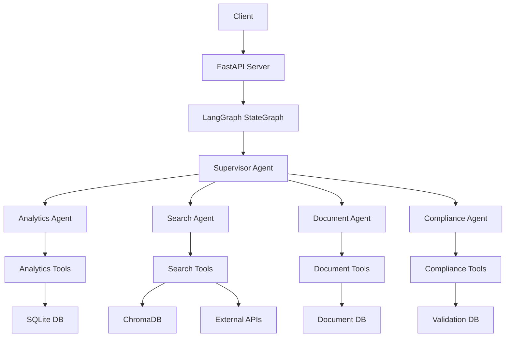

# 🚀 Sales Support AI Backend - LangGraph 0.6.6

## 📋 목차
- [프로젝트 개요](#-프로젝트-개요)
- [주요 특징](#-주요-특징)
- [시스템 아키텍처](#-시스템-아키텍처)
- [프로젝트 구조](#-프로젝트-구조)
- [에이전트 상세](#-에이전트-상세)
- [도구 모듈](#-도구-모듈)
- [설치 및 실행](#-설치-및-실행)
- [API 엔드포인트](#-api-엔드포인트)
- [테스트](#-테스트)
- [기술 스택](#-기술-스택)

## 🎯 프로젝트 개요

**Sales Support AI Backend**는 LangGraph 0.6.6 기반의 멀티 에이전트 시스템으로, 영업 지원을 위한 종합적인 AI 솔루션입니다. StateGraph 패턴을 활용하여 5개의 전문 에이전트가 협업하며, 데이터 분석, 문서 생성, 법규 준수 검증 등을 자동화합니다.

### 핵심 가치
- 🤖 **지능형 작업 라우팅**: Supervisor가 작업을 자동으로 적절한 에이전트에 배분
- 📊 **실시간 데이터 분석**: SQLite + Pandas 기반 심층 분석
- 🔍 **멀티소스 검색**: ChromaDB + 외부 API 통합 검색
- 📄 **자연어 문서 생성**: 한국어/영어 자연어를 구조화된 문서로 변환
- ⚖️ **규정 준수 자동화**: 의료법, 리베이트법, 공정거래법 자동 검증

## 🌟 주요 특징

### 1. LangGraph 0.6.6 최신 기능 활용
- **StateGraph Pattern**: 상태 기반 그래프 실행
- **START/END Nodes**: 명시적 시작/종료 포인트
- **Conditional Edges**: 동적 라우팅 지원
- **Checkpointer**: MemorySaver/SqliteSaver로 대화 기록 관리
- **Tool Integration**: @tool 데코레이터로 도구 통합

### 2. 멀티 에이전트 시스템
- **5개 전문 에이전트**: 각 도메인별 특화 처리
- **자동 협업**: 에이전트 간 자동 라우팅
- **컨텍스트 보존**: 작업 진행 상태 실시간 추적

### 3. 엔터프라이즈 기능
- **Rule Engine**: 패턴 기반 규정 위반 검출
- **Vector Search**: Kure-v1 임베딩 + BGE-reranker-ko
- **Natural Language Processing**: 한국어/영어 자연어 파싱
- **Audit Trail**: 모든 검증 결과 SQLite 저장

## 🏗️ 시스템 아키텍처



## 📁 프로젝트 구조

```
backend/
├── 📄 main.py                     # 메인 진입점 (FastAPI 서버 실행)
├── 📄 README.md                   # 프로젝트 문서 (현재 파일)
├── 📄 ARCHITECTURE.md             # 상세 아키텍처 설계
├── 📄 requirements.txt            # Python 패키지 의존성
├── 📄 .env                        # 환경 변수 설정
│
├── 📂 src/                        # 소스 코드
│   ├── 📂 api/                   # API 레이어
│   │   ├── app.py               # FastAPI 애플리케이션 정의
│   │   ├── routes.py            # API 라우트 정의
│   │   └── mock_db.py           # Mock 데이터베이스 API
│   │
│   ├── 📂 core/                  # 핵심 모듈
│   │   └── graph.py             # LangGraph StateGraph 정의
│   │
│   ├── 📂 state/                 # 상태 관리
│   │   └── agent_state.py       # AgentState TypedDict 정의
│   │
│   ├── 📂 agents/                # 에이전트 구현
│   │   ├── supervisor.py        # 라우팅 및 조정 에이전트
│   │   ├── analytics.py         # 데이터 분석 에이전트
│   │   ├── search.py            # 검색 에이전트
│   │   ├── document.py          # 문서 생성 에이전트
│   │   └── compliance.py        # 규정 준수 에이전트
│   │
│   └── 📂 tools/                 # 도구 모듈
│       ├── database.py          # 기본 데이터베이스 도구
│       ├── analytics_tools.py   # 분석 도구 (SQLite + Pandas)
│       ├── search_tools.py      # 검색 도구 (ChromaDB + API)
│       ├── document_tools.py    # 문서 도구 (NLP + Templates)
│       └── compliance_tools.py  # 규정 도구 (Rule Engine)
│
├── 📂 tests/                      # 테스트 파일
│   ├── test_graph.py            # StateGraph 테스트
│   ├── test_supervisor.py       # Supervisor 테스트
│   ├── test_analytics.py        # Analytics 테스트
│   ├── test_search.py           # Search 테스트
│   ├── test_document.py         # Document 테스트
│   └── test_compliance.py       # Compliance 테스트
│
└── 📂 data/                       # 데이터 저장소
    ├── sales_mock.db            # Mock 영업 데이터
    ├── chroma_db/               # ChromaDB 벡터 저장소
    ├── documents.db             # 문서 데이터베이스
    └── validation_results.db    # 검증 결과 데이터베이스
```

## 🤖 에이전트 상세

### 1. Supervisor Agent (`supervisor.py`)
**역할**: 작업 라우팅 및 에이전트 조정

**주요 기능**:
- 사용자 요청 분석 및 작업 유형 결정
- 적절한 에이전트로 자동 라우팅
- Document → Compliance 자동 라우팅 지원
- 작업 진행 상태 추적

**라우팅 규칙**:
```python
- "analyze" → Analytics Agent
- "search" → Search Agent  
- "document" → Document Agent
- "compliance" → Compliance Agent
- "validate" → Compliance Agent
```

### 2. Analytics Agent (`analytics.py`)
**역할**: 데이터 분석 및 인사이트 생성

**주요 기능**:
- SQLite 데이터베이스 쿼리
- Pandas 기반 데이터 분석
- KPI 계산 및 성과 지표 생성
- 트렌드 예측 (이동평균 기반)
- 시각화 데이터 준비

**도구**:
- `query_performance_data`: 직원 성과 데이터 조회
- `analyze_sales_trend`: 판매 트렌드 분석
- `calculate_kpis`: KPI 계산
- `analyze_customer_segments`: 고객 세그먼트 분석
- `predict_sales_trend`: 판매 예측

### 3. Search Agent (`search.py`)
**역할**: 멀티소스 정보 검색 및 통합

**주요 기능**:
- 3단계 우선순위 검색 (Internal → Vector → External)
- ChromaDB 벡터 검색 (Kure-v1 임베딩)
- BGE-reranker-ko 기반 결과 재순위화
- 검색 결과 병합 및 요약

**검색 우선순위**:
1. **Internal DB**: SQLite 구조화 데이터
2. **Vector DB**: ChromaDB 벡터 검색
3. **External API**: Naver/Google API (필요시)

**Collections**:
- `products`: 제품 정보
- `customers`: 고객 정보
- `documents`: 문서
- `knowledge`: 지식 베이스

### 4. Document Agent (`document.py`)
**역할**: 자연어 문서 생성 및 관리

**주요 기능**:
- 자연어 → 구조화 문서 변환
- 다양한 문서 템플릿 지원
- 동적 저장소 결정 (구조화/비구조화)
- 자동 Compliance 라우팅

**문서 유형**:
- **방문 보고서** (Visit Report)
- **제품 데모 요청/보고서** (Demo Request/Report)
- **샘플 요청** (Sample Request)
- **비즈니스 제안서** (Business Proposal)
- **회의록** (Meeting Notes)
- **규정 준수 보고서** (Compliance Report)

### 5. Compliance Agent (`compliance.py`)
**역할**: 법규 준수 검증 및 위험 평가

**주요 기능**:
- 2단계 검증 (1차 법률 → 2차 내규)
- Rule Engine 패턴 기반 위반 검출
- 위반 수준별 점수 계산
- 수정 제안 자동 생성
- 검증 결과 데이터베이스 저장

**검증 항목**:

**1차 검증 - 법률 위반**:
- 의료법: 의료기기 광고, 처방전 제품
- 리베이트법: 경제적 이익, 접대, 학회 지원
- 공정거래법: 담합, 독점, 허위광고
- 개인정보보호법: 민감정보, 제3자 제공

**2차 검증 - 회사 내규**:
- 할인율 제한 (최대 30%)
- 계약 기간 (5년 이하)
- 결제 조건 (선불 제한)

## 🛠️ 도구 모듈

### 1. Analytics Tools (`analytics_tools.py`)
```python
class MockDatabase:
    - 직원 성과 데이터 관리
    - 판매 데이터 분석
    - 고객 세그먼트 분석
    - KPI 계산 로직
```

### 2. Search Tools (`search_tools.py`)
```python
class VectorDB:
    - ChromaDB 컬렉션 관리
    - Kure-v1 임베딩
    - 유사도 검색

class SearchModels:
    - BGE-reranker-ko 모델
    - 검색 결과 재순위화
```

### 3. Document Tools (`document_tools.py`)
```python
class DocumentDB:
    - 구조화/비구조화 문서 저장
    - 문서 검색 및 업데이트
    
Document Templates:
    - 각 문서 유형별 템플릿
    - 자연어 파싱 로직
```

### 4. Compliance Tools (`compliance_tools.py`)
```python
class RuleEngine:
    - 패턴 기반 위반 검출
    - 정규식 매칭
    
class ValidationDB:
    - 검증 결과 저장
    - 감사 추적 관리
```

## 🚀 설치 및 실행

### 1. 환경 설정
```bash
# 가상환경 생성
python -m venv venv

# 가상환경 활성화
# Windows
venv\Scripts\activate
# Linux/Mac
source venv/bin/activate

# 패키지 설치
pip install -r requirements.txt
```

### 2. 환경 변수 설정
```bash
# .env 파일 생성
cp .env.example .env

# 필수 환경 변수
OPENAI_API_KEY=your-openai-api-key
API_HOST=0.0.0.0
API_PORT=8000
USE_SQLITE_CHECKPOINTER=false
MOCK_DB_ENABLED=true
```

### 3. 서버 실행
```bash
# 개발 모드 (자동 리로드)
python main.py

# 또는 uvicorn 직접 실행
uvicorn src.api.app:app --reload --host 0.0.0.0 --port 8000
```

## 📡 API 엔드포인트

### 메인 엔드포인트

#### 1. Graph 실행
```http
POST /api/graph/invoke
Content-Type: application/json

{
    "input": "삼성전자 고객 정보 검색하고 분석해줘",
    "config": {
        "configurable": {
            "thread_id": "thread-123"
        }
    }
}
```

#### 2. WebSocket 스트리밍
```javascript
ws://localhost:8000/ws/stream

// 메시지 형식
{
    "input": "실시간 분석 요청",
    "thread_id": "stream-123"
}
```

### Mock DB 엔드포인트

#### 고객 조회
```http
GET /api/db/mock/customers
GET /api/db/mock/customers/{customer_id}
```

#### 제품 조회
```http
GET /api/db/mock/products
GET /api/db/mock/products/{product_id}
```

#### 판매 데이터
```http
GET /api/db/mock/sales
GET /api/db/mock/sales/{sale_id}
```

#### 분석 생성
```http
POST /api/db/mock/analytics/generate
```

### 상태 확인

#### 헬스 체크
```http
GET /health
Response: {"status": "healthy", "timestamp": "2024-01-15T10:00:00"}
```

#### 메트릭스
```http
GET /metrics
Response: {
    "total_requests": 1234,
    "active_threads": 5,
    "average_response_time": 0.23
}
```

## 🧪 테스트

### 전체 테스트 실행
```bash
# 모든 테스트 실행
pytest

# 커버리지 포함
pytest --cov=src --cov-report=html
```

### 개별 테스트 실행
```bash
# Graph 테스트
pytest tests/test_graph.py

# Supervisor 테스트
pytest tests/test_supervisor.py

# Analytics 테스트
pytest tests/test_analytics.py

# Search 테스트
pytest tests/test_search.py

# Document 테스트
pytest tests/test_document.py

# Compliance 테스트
pytest tests/test_compliance.py
```

### 테스트 구조
- **단위 테스트**: 각 도구 및 함수별 테스트
- **통합 테스트**: 에이전트 간 상호작용 테스트
- **E2E 테스트**: 전체 플로우 테스트

## 💻 기술 스택

### 핵심 프레임워크
- **LangGraph**: 0.6.6 - 멀티 에이전트 오케스트레이션
- **LangChain**: 0.3.15 - LLM 통합 및 도구
- **FastAPI**: 0.115.6 - 비동기 웹 프레임워크
- **OpenAI**: GPT-4o-mini - LLM 모델

### 데이터 처리
- **SQLite**: 구조화 데이터 저장
- **ChromaDB**: 벡터 데이터베이스
- **Pandas**: 데이터 분석
- **NumPy**: 수치 계산

### 임베딩 & 모델
- **Kure-v1**: 한국어 특화 임베딩
- **BGE-reranker-ko**: 한국어 재순위 모델

### 개발 도구
- **Pytest**: 테스트 프레임워크
- **Loguru**: 로깅
- **Python-dotenv**: 환경 변수 관리
- **Uvicorn**: ASGI 서버

## 📊 성능 최적화

### 1. 싱글톤 패턴
- SearchModels, VectorDB 인스턴스 재사용
- 모델 로딩 시간 최소화

### 2. 우선순위 검색
- Internal DB 우선 검색으로 API 비용 절감
- 필요시에만 외부 API 호출

### 3. 비동기 처리
- FastAPI 비동기 엔드포인트
- WebSocket 실시간 스트리밍

### 4. 캐싱
- ChromaDB 벡터 캐싱
- 자주 사용되는 쿼리 결과 캐싱

## 🔒 보안 고려사항

### 1. API 키 관리
- 환경 변수로 민감 정보 관리
- .env 파일 Git 제외

### 2. 입력 검증
- 모든 API 입력 검증
- SQL 인젝션 방지

### 3. 규정 준수
- 개인정보 암호화
- 감사 로그 유지

## 📝 라이선스

이 프로젝트는 비공개 소프트웨어입니다.

## 👥 기여자

- AI System Architect: Claude
- Project Manager: User

## 📞 문의

프로젝트 관련 문의사항은 Issue를 통해 연락주세요.

---

**Last Updated**: 2024-01-15
**Version**: 1.0.0
**LangGraph Version**: 0.6.6
